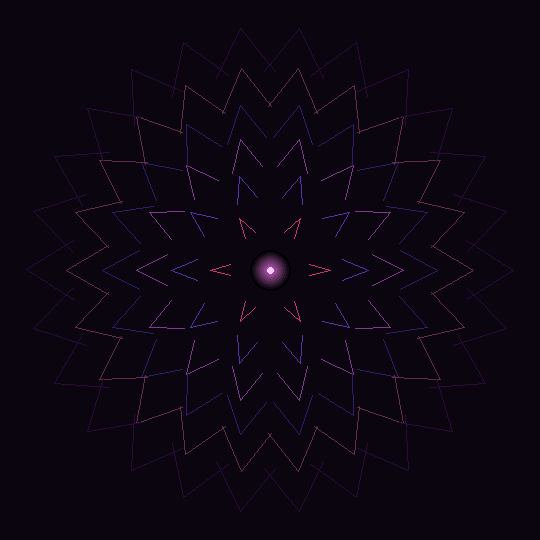
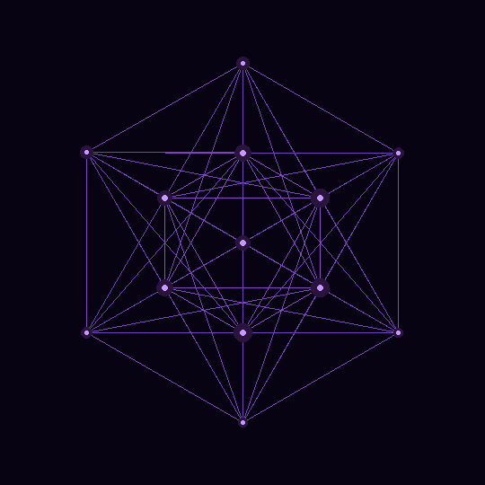
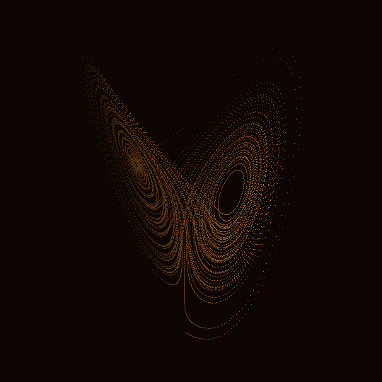

# AI Art

> A growing gallery of code-generated art collections — sacred geometry, mathematical beauty, and generative designs.

**[View the gallery](https://artemiopadilla.github.io/ai-art/)**

## Collections

### Geometria Sacred Patterns

| Category | Count | Format | Description |
|---|---|---|---|
| Sacred Geometry Posters | 60 | PDF (A3 vector) | Mathematical art from Flower of Life to Cosmic Web |
| Animated Loops | 15 | GIF (540px, 60fps) | Perfectly looping sacred geometry animations |
| Standalone Pieces | 6 | PNG, GIF, PDF, SVG, HTML | Individual artworks in various formats |
| Generator Scripts | 5 | Python | Full source code to regenerate everything |

## Quick start

```bash
# Clone
git clone https://github.com/ArtemioPadilla/ai-art.git
cd ai-art/collections/geometria-sacred-patterns

# Setup
python3 -m venv .venv
source .venv/bin/activate
pip install reportlab Pillow

# Generate
python3 gen_001_015.py   # PDFs 001-015
python3 gen_016_030.py   # PDFs 016-030
python3 gen_031_045.py   # PDFs 031-045
python3 gen_046_060.py   # PDFs 046-060
python3 gen_gifs.py      # 15 animated GIFs
```

## Preview locally

```bash
# From repo root
python3 -m http.server
# Open http://localhost:8000
```

## Highlights

### Animated GIFs (perfect loops)

| | | |
|---|---|---|
|  |  |  |
|  |  |  |

### Techniques used

- **Transparency layering** — multiple alpha passes for glow effects
- **3D/4D projection** — perspective transforms for torus, geodesic, tesseract
- **Parametric curves** — Lissajous, spirograph, torus knots, rose curves
- **Fractal recursion** — Sierpinski, Koch, Dragon curve, fractal trees
- **ODE integration** — Lorenz, Rossler, Clifford strange attractors
- **Reaction-diffusion** — Gray-Scott Turing patterns
- **Monte Carlo sampling** — quantum orbital probability clouds
- **Bessel functions** — diffraction patterns (Airy disk)

## Adding a new collection

1. Create `collections/my-new-collection/`
2. Add art files + generator scripts
3. Write `data.js` exporting your item arrays
4. Copy an existing collection's `index.html` template
5. Add one entry to `collections/manifest.json`
6. Push — the hub automatically picks it up

## License

All art and code in this repository are free to use. Attribution appreciated.

## Documentation

See [collections/geometria-sacred-patterns/README.md](collections/geometria-sacred-patterns/README.md) for detailed documentation on the generation process, design rules, and how to create new designs.
